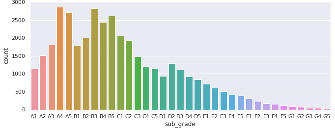

# Data Science Portfolio

## Exploratory Data Analysis
### Lending Club Default Identification

This is Exploratory Data Analysis for a company called Lending Club. Lending Club provides loans to the customers through investors. Most of the people repay the loan, but some don't. They are defaulters. The past data of Lending Club is analysed to identify different factors which might help identify the defaulters before approving the loan, so the company will not lose business.

## Machine Learning
### Bike Sharing - Linear Regression

